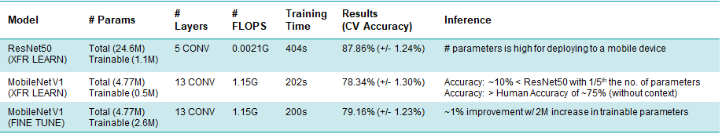

# Clinical-Heart-Failure-Detection-Using-Whole-Slide-Images-of-H-E-tissue
This project implements code for detecting clinical heart failure from whole slide images of H&E tissue using CNN in Python.

## Aim of the Project 
Automated detection of clinical heart failure from Whole-Slide Images of H&E tissue using a Convolutional Neural Network. Determine whether the given histopathology patch image (250x250x3) is normal or has a heart failure (binary classification).

## Background 
This project (till Version 0.19) was done as a Capstone Project as part of 'Advanced Program in Digital Health and Imaging - Cohort1 - Aug'20 to Jan'21' from Indian Institute of Science (IISc), Bengaluru.
- Project Contributors: **Chinmoy Raj Hota** and **Ashwin Kumar**
- Project Mentor: **Dr. Phaneendra Yalavarthy, Associate Professor, Computational Data Science Dept.(CDS), IISc**
- Supported by: **Naveen Paluru, PhD Scholar at CDS, IISc**

We express our sincere gratitude to the Dr. Phaneendra and Naveen for the guidance and support in completing the project. We are very thankful to the Cohort1 Group Members for the class interactions which enhanced our knowledge. We also would like to thank the creators/authors of the information mentioned in the References section which helped us a lot in the project development. 

Post course completion, Chinmoy continued on further work beyond Version 0.19.

## Capstone Project Summary (till Version 0.19) 

### Methods that have been deployed 
- Transfer Learning with ResNet50
- Transfer Learning and Fine Tuning with MobileNet V1

### Computing Resources Utilized 
- Pre-trained ResNet50 and MobileNet V1
- Google Colab GPU

### Dataset Details 
- Location: https://idr.openmicroscopy.org/webclient/?show=project-402
- Breakup of training/test instances: Training = 770# , Validation = 374#, Test = 1155#

### Details of Model 
- Pre-trained ResNet50 + Custom FCN Layer
- Pre-trained MobileNet V1 + Custom FCN Layer
- Hidden Units in FCN after Conv: 512 Neurons, Dropout = 0.4
- Loss Function = Cross Entropy.  
- Optimizer = Adam, Learning Rate = 0.01
- Epoch = 100, Batchsize = 10
- Cross Validation(CV): Stratified K Fold, 4 Folds

### Summary 

